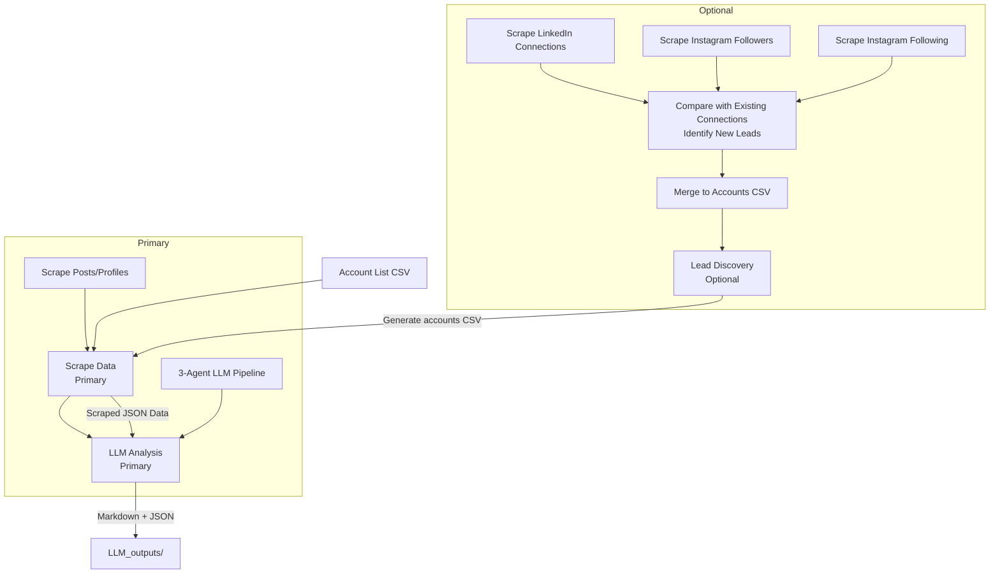

# Unified Social Media Scraper

## Overview

This project provides tools for insurance lead generation from social media data. The user journey consists of three steps:

1. **Lead Discovery** - Scrape your own social media connections/followers/following to discover new leads
2. **Scrape Data** - Scrape posts and profile data from identified accounts
3. **LLM Analysis** - Analyze scraped data with a 3-agent Doubao LLM pipeline to generate insurance lead insights

This repository **focuses primarily on Steps 2 & 3**, but also provides optional functionality for Step 1.



## Table of Contents
- [Unified Social Media Scraper](#unified-social-media-scraper)
  - [Overview](#overview)
  - [Table of Contents](#table-of-contents)
  - [Example Output](#example-output)
  - [Installation](#installation)
  - [Authentication](#authentication)
  - [Prepare Account List](#prepare-account-list)
  - [Primary Usage](#primary-usage)
    - [Scrape Data](#scrape-data)
    - [LLM Analysis](#llm-analysis)
    - [End-to-End Pipeline](#end-to-end-pipeline)
  - [Additional Functionality](#additional-functionality)
    - [Lead Discovery](#lead-discovery)
      - [Scrape LinkedIn Connections](#scrape-linkedin-connections)
      - [Scrape Instagram Followers](#scrape-instagram-followers)
      - [Scrape Instagram Following](#scrape-instagram-following)
      - [Merge All New Leads to Accounts CSV](#merge-all-new-leads-to-accounts-csv)
  - [Directory Structure](#directory-structure)
  - [Output Structure](#output-structure)
  - [Project Structure](#project-structure)
  - [Features](#features)
  - [Notes](#notes)
  - [Requirements](#requirements)
  - [Acknowledgments](#acknowledgments)
  - [License](#license)

## Example Output

Below is a compressed, anonymized example combining elements from multiple LLM-generated lead analyses:

```markdown
# Insurance Lead Analysis: Example_User

Generated: 2026-04-16
Date range: 2025-04-01 to 2025-12-31
Sources: Instagram, Xiaohongshu, LinkedIn

---

## Profile Summary

This early-career professional has an impressive academic background, with degrees from top universities in Asia and North America. They currently work in a skilled role (either finance or tech) at a reputable firm, with a stable income and clear career progression. They've lived in multiple countries and cities, demonstrating adaptability and a global perspective.

In their personal life, they are an avid traveler who frequently documents international adventures on social media. They also value personal growth, sharing educational and career advice with their network. They are in a committed long-term relationship and are mindful about balancing career success with personal well-being.

### Key Insights

- Frequent international travel creates strong opportunities for comprehensive travel insurance with emergency medical coverage
- Stable professional income makes disability income insurance a critical offering to protect their earning potential
- Analytical, data-driven background means they respond best to transparent, clearly explained insurance options
- Long-term committed relationship indicates life insurance could be a priority
- Active social media presence suggests referral opportunities with their engaged network
- Cross-border living experience may require specialized international coverage options

---

## Propensity Indicators

| Indicator | Status |
|-----------|--------|
| Recent Travel | ✓ Yes |
| Recent Marriage/Engagement | ✗ No |
| New Child/Pregnancy | ✗ No |
| New Job/Promotion | ✓ Yes |
| New Home/Move | ✗ No |
| Car Purchase | ✗ No |
| Health Focus/Issues | ✗ No |
| Sports/Hobbies | ✓ Yes |
| Family-Focused | ✗ No |
| Retirement Planning | ✗ No |

---

## Recommended Selling Points

### Travel Insurance

Given your frequent international travel to destinations across Europe, Asia, and the Americas, I recommend a comprehensive travel insurance plan that covers emergency medical care abroad, trip cancellation, lost luggage, and camera/gear protection. This will protect your travel investments and give you peace of mind during your adventures.

**Why this matters**: International travel exposes you to unexpected risks like foreign medical emergencies and trip disruptions, and this plan will cover those costs so you don't face unexpected financial burdens.

---

### Disability Income Insurance

As a full-time professional with a stable, competitive income, your ability to work is your most valuable financial asset. I recommend a tailored disability income insurance plan that replaces a portion of your monthly income if you become unable to work due to illness or injury.

**Why this matters**: Your career relies entirely on your ability to work, so this insurance will prevent a career-altering injury or illness from derailing your financial progress.

---

### Term Life Insurance

As an early-career professional building your long-term financial foundation and in a committed relationship, I recommend an affordable term life insurance plan. This low-cost plan provides tax-free financial protection for your loved ones with rates tailored to your current income level.

**Why this matters**: You're just starting to build your long-term financial security, and term life insurance offers a low-barrier way to protect your loved ones without straining your current budget.
```


## Installation

1. Clone the project:
```bash
cd social-media-scraper
```

2. Install Python dependencies (use `uv` for best results):
```bash
uv sync
```

If you don't have uv, you can use pip with a virtual environment:
```bash
python -m venv .venv
source .venv/bin/activate  # On Windows: .venv\Scripts\activate
pip install --upgrade pip
pip install pydantic python-dotenv click loguru aiofiles aiohttp pandas PyExecJS retry opencv-python numpy qrcode openpyxl playwright beautifulsoup4 requests lxml openai volcengine-python-sdk[ark]
```

3. Install Node.js dependencies:
```bash
npm install
```

4. Install Playwright browsers:
```bash
# If using uv
uv run playwright install chromium

# If not using uv, activate your virtual environment first then:
# playwright install chromium
```

5. Copy `.env.example` to `.env`:
```bash
cp .env.example .env
```

## Authentication

Login to each platform once to save credentials:

```bash
# Login to Xiaohongshu (saves cookies to .env)
uv run run.py login-xiaohongshu

# Login to Instagram (saves persistent session)
uv run run.py login-instagram

# Login to LinkedIn (saves persistent session)
uv run run.py login-linkedin
```

Follow the interactive prompts - scan QR code / login manually in the browser, then press Enter to save the session.

## Prepare Account List

Create a CSV file (or use `accounts/example.csv`):

```csv
name,instagram,xiaohongshu,linkedin
Account Name,instagram_handle,xiaohongshu_url, linkedin_id
```

- `name`: Account name (required, used for output directory)
- `instagram`: Instagram username (optional, leave empty to skip)
- `xiaohongshu`: Xiaohongshu URL (optional, leave empty to skip)
- `linkedin`: LinkedIn profile URL (optional, leave empty to skip)

## Primary Usage

### Scrape Data

Scrape posts and profile data from the accounts in your CSV:

```bash
uv run run.py scrape \
  --accounts accounts/example.csv \
  --output data/ \
  --from-date 2025-01-01 \
  --to-date 2025-12-31 \
  --download-media
```

Options:
- `--accounts`: Path to your accounts CSV (required)
- `--output`: Output directory for JSON results (required)
- `--from-date`: Only include posts on or after this date (YYYY-MM-DD, optional)
- `--to-date`: Only include posts on or before this date (YYYY-MM-DD, optional)
- `--download-media`: Download images/videos (optional, saves to `media/`)

### LLM Analysis

Analyze the scraped social media data using a 3-agent Doubao LLM pipeline to generate insurance lead insights:

```bash
uv run run.py generate-llm-outputs \
  --input data/ \
  --output LLM_outputs/ \
  --from-date 2025-01-01 \
  --to-date 2025-12-31 \
  [--account "Account Name"] \
  [--no-json]
```

Options:
- `--input`: Input directory with scraped JSON data (usually `data/`, required)
- `--output`: Output directory for LLM results (usually `LLM_outputs/`, required)
- `--from-date`: Filter content after this date (YYYY-MM-DD, optional)
- `--to-date`: Filter content before this date (YYYY-MM-DD, optional)
- `--account`: Only process a specific account (for testing, optional)
- `--no-json`: Don't save JSON output, only markdown (optional)

**Note:** You need to configure `DOUBAO_API_KEY` and `DOUBAO_ENDPOINT` in your `.env` file for LLM analysis.

### End-to-End Pipeline

You can run the complete pipeline (clean + scrape + LLM analysis) in one command:

```bash
uv run run.py pipeline \
  --accounts accounts/example.csv \
  --from-date 2025-01-01 \
  --to-date 2025-12-31 \
  --download-media \
  [--no-clean]
```

Options:
- `--accounts`: Path to your accounts CSV (required)
- `--from-date`: Start date (YYYY-MM-DD, optional)
- `--to-date`: End date (YYYY-MM-DD, optional)
- `--download-media`: Download images/videos (optional)
- `--no-clean`: Skip cleaning data/media folders before run (optional)

This will:
1. Clean up `data/` and `media/` folders (unless `--no-clean`)
2. Scrape all accounts
3. Generate lead summaries with LLM

## Additional Functionality

### Lead Discovery

Optionally discover new leads by scraping your own social media connections/followers/following:

**How it works**:
1. Scraped connections are saved to `existing_connections/` (for future comparison)
2. Automatically compares with previous scrape results to identify only new leads
3. New leads are saved to `new_leads/` in both JSON and CSV formats

**Note**:
- **LinkedIn**: Lists connections reverse chronologically (latest first), so scraping the most recent 100 connections are enough for new connection discovery 
- **Instagram**: Scrapes all followers/following by default because there is no orders 

#### Scrape LinkedIn Connections

```bash
uv run run.py scrape-linkedin-connections \
  --output existing_connections/linkedin \
  --new-leads-dir new_leads
```

Options:
- `--max-connections`: Maximum number of connections to scrape (default: 100)
- `--output`: Directory to save connections (default: existing_connections/linkedin)
- `--new-leads-dir`: Directory to save new leads (default: new_leads)
- `--scrape-profiles`: Also scrape full profiles for new connections

#### Scrape Instagram Followers

```bash
uv run run.py scrape-instagram-followers \
  --username your_username
```

Options:
- `--max-connections`: Maximum number of followers to scrape (default: all)

#### Scrape Instagram Following

```bash
uv run run.py scrape-instagram-following \
  --username your_username
```

Options:
- `--max-connections`: Maximum number of following to scrape (default: all)

#### Merge All New Leads to Accounts CSV

```bash
uv run run.py merge-all-leads-to-accounts \
  --new-leads-dir new_leads \
  --accounts-csv accounts/leads.csv
```

This will:
- Read all JSON files from `new_leads/`
- Merge them into `accounts/leads.csv`
- Use username as name when name is unknown
- Avoid duplicates

## Directory Structure

```
social-media-scraper/
├── accounts/              # Account CSV files (leads to scrape)
├── new_leads/             # Newly discovered connections (JSON + CSV)
├── existing_connections/  # Your existing connections (for comparison)
│   ├── instagram_followers/
│   ├── instagram_following/
│   └── linkedin/
├── LLM_outputs/           # LLM-generated analysis results
├── data/                  # Scraped social media data
└── media/                 # Downloaded images/videos
```

## Output Structure

Scraped data:
```
data/
└── {account_name}/
    ├── metadata.json      # Combined metadata
    ├── instagram.json     # Instagram posts
    ├── xiaohongshu.json   # Xiaohongshu notes
    └── linkedin.json      # LinkedIn profile data
```

If media download is enabled, media files go to:
```
media/
└── {account_name}/
    ├── instagram/
    └── xiaohongshu/
```

LLM outputs:
```
LLM_outputs/
├── {account_name}.md      # Comprehensive lead analysis (markdown)
├── {account_name}.json    # Structured LLM outputs
└── structured_data.csv    # Combined propensity indicators
```

## Project Structure

```
src/social_media_scraper/
├── cli.py              # Unified CLI entry point
├── models.py           # Common Pydantic models
├── config.py           # Configuration loading
├── output.py           # JSON output handling
├── csv_exporter.py     # Convert new leads to accounts CSV
├── xiaohongshu/        # Xiaohongshu scraper (imported from Spider_XHS)
├── instagram/          # Instagram scraper (imported from social_listening)
├── linkedin/           # LinkedIn scraper (imported from linkedin_scraper)
└── llm_analyzer/       # LLM-based analysis (3-agent Doubao pipeline)
```

## Features

- Reads a single account list CSV with all platforms
- One-time interactive login for all platforms (persists cookies/sessions)
- Date filtering for Xiaohongshu and Instagram posts
- JSON output only (organized by account)
- Preserves all original scraper logic
- **Optional**: Built-in lead discovery for your own social connections
- Built-in LLM analysis with 3-agent pipeline (Doubao/ByteDance Ark)

## Notes

- Xiaohongshu still requires Node.js for signature generation (this is preserved from original)
- All original scraping logic is kept intact, only wrapped with a unified interface
- If scraping fails for one platform/account, it continues with the next
- Sessions persist between runs, you don't need to login every time
- "Leads" refer to contact information (connections/followers); LLM outputs are stored separately in `LLM_outputs/`

## Requirements

- Python 3.10+
- Node.js (for Xiaohongshu signature generation)
- `uv` (Python package manager)

## Acknowledgments

This project incorporates code from the following open-source projects:

- **Spider_XHS** (Xiaohongshu scraper): https://github.com/cv-cat/Spider_XHS - MIT License
- **linkedin_scraper** (LinkedIn scraper): https://github.com/joeyism/linkedin_scraper - Apache License 2.0

## License

This project follows the licenses of the incorporated components:
- Xiaohongshu scraper portion: MIT License
- LinkedIn scraper portion: Apache License 2.0
